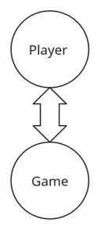
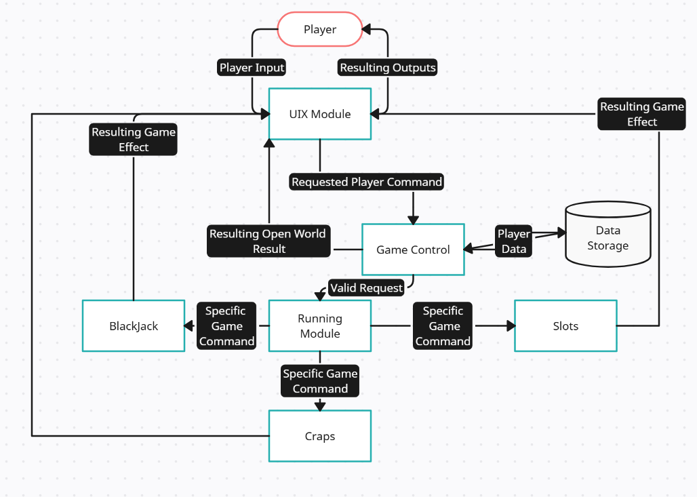
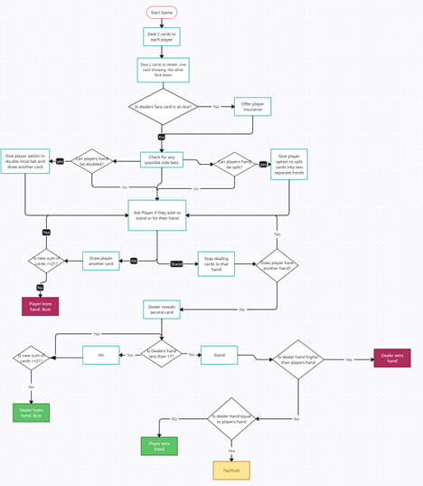
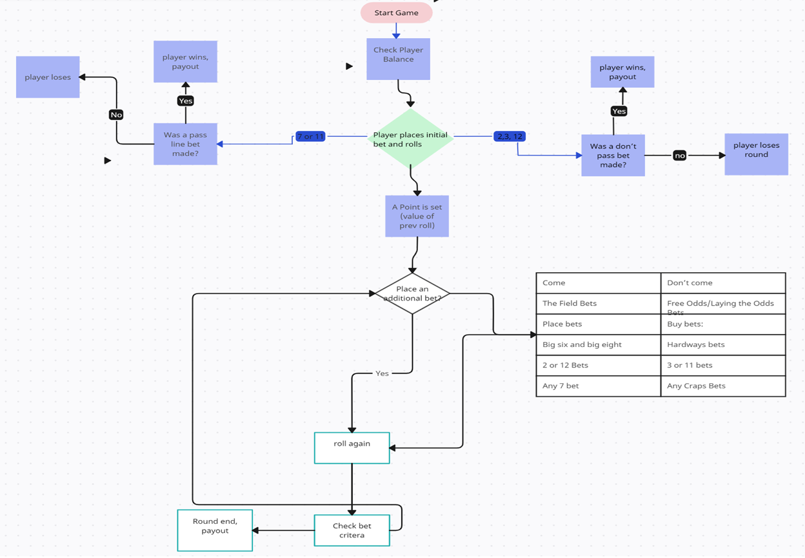
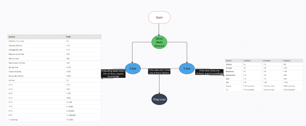

# CSCI 265 Design (Phase 3\)

## Team name: Section 3

## Project/product name: Gambling Simulator

## Contact person and email

The following person has been designated the main contact person for questions from the reader:

 -  Josiah Bowden, [josiahbowden4@gmail.com](mailto:josiahbowden4@gmail.com)

## Overview

This document outlines the design for Gambling Simulator. The goal is to provide a single-player casino experience, where the player can engage in games such as Blackjack, Craps, and slots. The entire game will run on the player’s machine, allowing them to explore various games at their own pace. The gameplay takes place in a virtual casino environment, and the player controls an avatar that moves around the casino floor, interacts with game tables and machines. 

Key Features and mechanics include:

1) Player information management: current balance, stats.  
2) Visual representation of NPCs: Dealers or other casino staff, though they won’t be interactive.  
3) Game interfaces: Overworld heads-up display(tutorial/help box, balance), and interface for each game where player can bet and play.  
4) Player action detection: Moving, interacting with tables, placing bets, interacting with game buttons.  
5) Game mechanics and logic for each game: Handling card draws in Blackjack, reel spins in Slots, dice rolls in Craps  
6) Sound effects: Card shuffling and dealing, slot machine spins, dice rolls  
7) Menu and interface navigation: Main menu, gameplay screens, options and out of money (game over) screen.

The primary design challenge is to ensure the game mechanics are accurate and engaging, including the development of a fair random number generator (RNG) to handle outcomes for all games. The design will prioritize functionality, focusing on creating a stable and integrated system where all components operate smoothly together.

## Core Design Influence

The design choices for Gambling Simulator were driven by the need to create a robust and seamless system where all components interact smoothly. Several factors shaped our approach:

1) Simplicity and Focus on Functionality: Our primary focus is on ensuring all game components work together efficiently. Rather than building complex visual elements or navigation, we opted for a straightforward interface that allows players to access and play the games without unnecessary distractions. This choice keeps development focused on core mechanics and ensures the system operates reliably.  
2) Modular Game Design: We chose a modular approach for each game (Blackjack, Slots, Craps), meaning each game functions as an independent component. This allows for easier testing, debugging, and integration. Each module shares common elements like the random number generator (RNG) for game outcomes, ensuring consistency across all games.  
3) Player-Centric Interaction: Since the game is single-player, the interaction design is kept simple and user-friendly. Players interact directly with the game interface, placing bets and playing after short navigation in the virtual world. This minimalistic approach ensures that the player can focus on the core casino experience, with minimal learning curve or distractions.  
4) Realistic Game Logic: Ensuring fairness and accuracy in game outcomes was a key factor in our design. The use of a fair RNG ensures all games adhere to standard casino rules, providing players with a realistic and transparent gambling experience.

In summary, our design decisions were influenced by the need for reliability, simplicity, and modular functionality, ensuring that every part of the system operates smoothly and consistently.

## System Context

With our game it will not be multiplayer, so it will just be a game downloaded and installed on the user's computer for them to play. The diagram below shows what it will look like  

## Architectural Design and Module Descriptions

In this section we go over the different modules the game is split up into. Our Preliminary Design splits the game up into 3 different modules

1. The Game Control Module  
2. The Running Module  
3. The UIX Module

In this section we will talk about the aspects of these modules and what they control. As well as how they will communicate with the other modules, with more description on the games data storage in the section following

#### Game Control  
For the player, this holds the information of how the game will be running, and will be used for communicating between the user interface and the running module. It will also hold the games active data, such as:

* The open World  
* Storing the Players Data  
* Validating players commands  
* Confirming when a game has ended or when a player has quit

##### The Open World  
This will take care of the casino that the character moves around in to get to the various games. It controls the physical layout, the visuals of the casino, the sounds they hear, and the ability to interact with the different tables and games. It will also hold the store if we manage to include that secondary goal of ours.

###### The Layout  
This is where the physical layout for the casino is, mapping where the tables will be. It also makes sure that the player can’t go through the walls or move through the tables, blocking their movement to ensure they don’t fall through the world.

###### The Visuals  
We want the player to feel like they really are at the casino, this includes making it look as authentic as possible. We plan to have bright lights surrounding the slot machines, a classic looking carpet floor, and tables with dealers that seem inviting to the player. There will also be posters/murals on the walls with slogans encouraging gambling. This isn’t going to be our primary focus, as functional gameplay is first priority.

###### The Sounds  
In the casino we want to have the authentic sounds one would find at a real casino. This includes loud dings of slot machines, and people talking/cheering for others wins. There will also be some music playing to make the game feel more atmospheric, and we don’t want to have a quiet and eerie feeling in the casino, we want it to be fun and feel exciting.  

###### Interacting with the games/store  
While the player is walking around the casino they will have the options to interact with the different tables and games throughout. We want to make sure that when the player arrives at the games that it allows them to interact with it and start playing them. If we manage to include the store for cosmetics, it will also be held in the open world. It will have a storefront, with prices listed in which they can buy with their in game currency. The cosmetics they buy with then be tied to their account and they can set it up for them to be used while they play.

##### Storing Player Data  
For the player it is important we store their bank balance accurately. This makes sure that when they win they get the correct amount back, and also making sure they can’t go into the negative. It will be stored using a bank account class that will have the functions of depositing and withdrawing. This is also where the player’s game will be saved, this lets them continue to earn more money over multiple play sessions. When/if we implement cosmetics the ones the player has purchased will also be kept here.

##### Validating Commands  
 While the UIX module will handle the user inputs, this module will make sure the inputs they are doing have a valid command. An example would be if they are in blackjack and try to split when they aren’t allowed to, the game doesn’t let them split even though they pressed the button for it.  

##### Confirming ending  
The game ends if the player runs out of money or if they choose to leave. The game needs to validate if they run out of money to give them the game over screen, and also respond when the player makes the request to leave the game. 

#### Running Module  
This module is responsible for the game engine and running the casino games. It controls the games npc’s, the blackjack dealer and the craps game runner, and the slot machines in the game. For communication it will receive commands from the running module, then give its response to the UIX. This is in the hopes that the commands the control module gives the running module are valid, then it gets sent to the output of the UIX for the player to see. View the diagram at the end of the system context for a visual representation of it.  This module is split up into:
 
* The Blackjack Module  
* The Craps Module  
* The Slots Module

##### Blackjack  
For running the blackjack table there will need to be a few parts to make sure it runs properly. We want the player to have an authentic blackjack experience and have the game run smoothly for them. We have broken it down into the following parts:

* Card dealing  
* Dealer Logic  
* Game logic

###### Card Dealing  
Dealing cards in a proper way is essential for any good casino. We are going to make a class for cards that ensures that any card has just as likely of chance as any of the other 52, and that when a card is dealt it can’t appear again that hand. For example when the first card is dealt it is just as likely to be the two of diamonds as it is to be the ace of clubs, and when one of those cards is dealt it can’t then be dealt again. There will also be an animation for the dealing to give the player something to look at while the deal is happening. We haven’t fully decided on how we are going to implement it yet but it will be in a class. We plan to have it in a class for further expansion, making future card games easier to implement.

###### Dealer Logic  
When the player is playing blackjack we want to make sure that the dealer is doing what it is supposed to. For the dealer they are to hit until their cards reach a value of at least 17\. We want to make sure the dealer at least reaches that. It must keep the dealer honest by having them able to bust on a hand. We will likely also have this be implemented as a class with specifics yet to be figured out.

###### Game Logic  
While the player is playing, we want the proper options to be available to the player. This includes having the two staple moves, hit and stand, available to the players at all time while the play is still happening, and making sure that the other betting options open up when the options arrive. Those options include split, when they have two cards with the same face/value, double, when their cards have a total value of 9-11, and insurance, when the dealer has a face up ace. Implementation of this is yet to be decided on how it will be done.

##### Craps  
Accurate bet logic is crucial for an accurate, fun and fair craps experience. To ensure this, we must correctly implement the payout odds, the win/lose criteria, and availability of each bet able to be placed. 

###### Dice  
For the dice we plan to implement it with a random number generator. With it being a d6 it will be a random number between 1 and 6\. It will do it twice, for the two dice that are used in craps. It then adds them together to get a final value. We want it to feel like real dice, with the same odds for all numbers to happen. There will also be an animation for the dice to give the player something to look at while it generates a number. We will plan to have this implemented as a class.

###### Game Logic  
When the player is playing craps, we want them to have an authentic experience and for it to feel smooth. There will be systems in place to ensure that the players bet is tracked properly, that the outcome matches what the player sees, and make sure that the correct payout to the outcome happens. Proper betting odds and the dice randomness will be important to monitor to ensure that they running in tandem, as we don’t want the dice to give us one thing and the game to interpret it as another. We have yet to decide how it will be implemented.   

##### Slots  
The slots game needs to have a randomizer for the different reels in order to emulate real slot machines. We plan to use a random number generator to represent the different symbols on the reels. This will be accompanied by an animation of the reels spinning, and showing the results of the spin. The logic needed for this game is simplistic in nature, making sure the player has the funds in their balance to play the game, and making sure that the payout and chances of winning are accurate. For implementation while nothing is set in stone we plan to use a class for the random generator for if we want to add more games that may need it. 

#### UIX Module  
This module is responsible for the user interface, including the player's inputs and the game's resulting outputs. This will be the only part that the player interacts with, and we want to ensure that what the player sees is accurate and is straightforward for them to follow. The UIX Module is split into two main parts, the input and the output, with specifics needs for each game.

##### The Input  
When a player presses a button on their keyboard we want to accept their input accurately. It will then take their input and send it to the game control module. We will have the keyboard mapped, with some of the ideas for different keys commands being:

* WASD movement  
* E to interact  
* Esc for the pase menu  
* Mouse Movement to move camera

We might let customization of keybinds but that is undecided. It then sends the resulting keystrokes or mouse clicks to the running module, which then confirms the command and makes sure the player's request is valid. After the game control module gets the request, validates it, then sends it to the running module to have the game do the request made. After the game makes the request it will send it back to the game control, and then goes back to the UIX module with its output.

##### Output  
After the game responds to the input, and the game control receives that result it then sends an output to the UIX module. This can include different visuals appearing on screen, such as a “YOU WIN\!\!” graphic if they win a hand or a “Try Again” if they lose. We also want to make sure that the sounds that go with it make sense, like a victory bell for a win or a sad trumpet sound for a loss. We also want to make sure that the rest of the HUD is accurate, like showing the correct buttons for interacting and moving around, and making sure that the balance being shown to the player is accurate. 

##### Game Specific UIX
We will now go over some specific needs for each game, including both the inputs and outputs.

###### Open World
Most of the open world inputs and outputs were shown in the earlier section, with WASD movement for the open world, and the different buttons to interact. For output we need to ensure that while the player is exploring the open world that they are currently viewing aligns with what they should be actually seeing. The players balance should also be shown, as since their is no current way for the players balance to change while they are roaming the hub it should stay as a static number. 

###### Blackjack
For blackjack the UIX module will need to incorporate player inputs for their bets and different decisions while they play. This will be done with on screen buttons they will press, with each valid betting option for them being made visible to the player. There will also be a place on the screen displaying the players current balance, as well as showing what their current bet is. For example if they have a balance of $1000 and they bet $50, it should show their $50 bet on the table and their balance should update to $950, and then change depending on the result. We also must ensure that the cards they see are accurate to what they actually have been dealt, as well as making sure they don’t see the cards they are not supposed to. 

###### Craps
For craps we also need to show the player their current balance, as well as what their current bet is. We also have to show the bets currently available to the player, starting with either a “pass bet” and a “don’t pass bet”, and then ensuring that their subsequent bets on different point bets are accurate. We also want to show the player the former results of the dice that have been played that round. For actually playing the games it will be a button system, with a roll button and then bet buttons.We also will be showing a dice animation, and the results of the dice on screen.

###### Slots
Same as the previous two games, we want to have the players balance updated as the game goes along and what the player is betting visible to them. This game will also be played with button presses, with different buttons to choose how many reels to bet on, the amount they are betting and a lever for them to click to spin the reels. For the spinning of the reels it will just be a randomly generated number with its corresponding symbol, and we want to have an animation for the reel visible to the player. 

#### Overview of the Modules  
It is important for the modules to function and communicate properly. The UIX handles the direct player inputs and the direct player output. Ensure that the player can’t change or impact the game logic or anything else that they aren’t supposed to touch. The UIX sends it to the game control module, which validates the player's command. The control module also handles the other logic surrounding the game, like where the player is in the casino, and the player's balance. It sends these requests made by the user to the running module, which is where the actual games run. This stores the rules for the games and the actual code and assets that run the game, ensuring bets and other things of the like. Below is a simple diagram showing how the modules connect.  
  
Module for the game running

## Data Design

In this section we go over how we will be storing data. For our game there is two main branches for what data we are storing, the players data and the games data.

### Players Data  
For the player we will be storing a two main aspects in their user profile, these include:

* The players username/id  
* The players in game balance
* The player’s purchased cosmetics

The username/id will be something they choose themselves, being able to call themselves whatever they choose. It may be tied to an email address, but the final decision on that is yet to be made. With the user having a profile, it makes it possible to store/save what they currently have in the balance across multiple sessions. Storing their balance is important because we don’t want to short out players while not giving them things for free. One of our secondary features we hope to implement is a store to buy cosmetics, and with the players profiles being saved it makes it possible for them to keep their cosmetics tied to their account. This could also lead to some fun end game stuff, like giving the player the option to sell their cosmetics to keep playing without going bankrupt. For that to happen we need to implement the store first. The players data will be stored in the game control module, and we will encourage players to not keep sensitive data in their profile as currently with the game not needing any personal data to play we won’t be over tight on security. We plan to store the players data even past when they close the game, we want to implement this by having save states that will store the players current game to their local device. This will make the player's ability to gamble feel like there is a bit more of a risk, as they wouldn’t just be able to restart and pretend like it never happened. 

### Game Data  
For the games we don’t play to store the data of previous play for blackjack or slots, while craps will store a few of the previous game for bets and to show the player what was just rolled. How that data will be stored is yet to be decided but it will likely be saved in a local file in the craps game folder. For the other games not storing data keeps the files needed smaller, and it's not needed to keep previous games as they have no impact on the game that is currently being played. 

## Game State and Flow of Play

For this section we lay out the current flow of the game. In the current version of Gambling Simulator, players can immerse themselves into a 3D casino currently featuring three unique games: Blackjack, Slots, and Dice(Craps). The game features a persistent balance which flows across all games, ensuring a continuous thrill until the balance reaches zero, allowing for strategic decisions as users can try to shift their luck from one game to another. 

The expected flow of events is listed below, with some steps bypassed if a player's balance hits zero, marking the end of their casino adventure.

### Flow of Events

The expected sequence of gameplay is structured as follows:

1. Game Start:  
    Players enter the casino with their initial balance.  
2. Game Selection:  
    Players will explore the casino, and can choose from Blackjack, Slots, or Craps to start their gambling experience.  
3. Gameplay Actions: 
   * Blackjack: Players engage in classic gameplay, trying to beat the dealer with strategic moves such as hitting, standing, or utilizing side bets.  
   * Slots: Players spin the reels, hoping for winning combinations that can significantly boost their balance.  
     1. Game starts with loading player balance into the craps module/main function.  
     2. The Player will select their initial bets and amounts for each bet, and at least one of either Pass /Don’t pass bets.  
     3. Flags will be set based on player bets  
     4. The player will initiate a dice roll sequence  
     5. The results of the dice roll will be interpreted. If the roll didn’t result in a round ending condition, the player will be able to make additional bets and roll again. If the round ends, the player will be paid out if they win.  
     6. Rounds may be played until the player runs out of money or the player chooses to quit.  
     7. The craps module will update the player’s balance upon exit.  
   * Craps: Players roll the dice, placing bets on various outcomes and experiencing the thrill of chance.  
4. Balance Update:  
    After each game, the persistent balance updates based on the outcomes, either increasing or decreasing the player's funds.  
5. Game Continuation:  
   Players can switch between games at any time, utilizing their luck and balance strategically to maximize their wins.

### Endgame Condition

At any stage the game may conclude when a player's balance reaches zero. Players must gamble wisely to keep the excitement alive and avoid going bankrupt.

### BlackJack Flow of Play

BlackJack will have a fairly straightforward flow of play, each hand having to go through the various possibilities and responding to the player's inputs. The stages are:

1. Game Start: player places their initial bet  
2. Deals 2 starting cards  
3. Deal 2 cards to the dealer, on face up the other face down  
   1. If the face up is an ace, give the player the option for an insurance bet  
4. Offer the player their available options  
   1. If they have two of the same card, offer them to split their hand  
   2. If their cards have a value equaling 9-11, offer them to double  
   3. Offer them to hit, gaining another card, busting if the value goes over 21  
   4. Let them stand, moving onto the next phase  
   5. Make sure if player has multiple hands from splitting that all of their hands are finished  
5. Dealer then play, hitting until their cards value at least 17,   
   1. If the dealer bust, players with still valid hands win  
   2. If the player has a higher value of cards, they win at a ratio of 3:2, example if you bet $10 you win $15  
   3. If the dealer has a higher value the player loses  
   4. If the dealer and player have the same value, its a push and the player gets their bet back  
6. End of the game

### Craps Flow of Play

1. Roll Phase  
- Player places a bet.   
- Player rolls two dice (come out roll)   
- If the result is 7 or 11, the player wins if a pass line bet was made. Otherwise player loses  
- If the result was 2,3, or 12, and a don’t pass bet was made, the player wins.   
- Any other value becomes a point. 

2. Point phase   
* Player continues rolling the dice

  *  If the player rolls the Point number again: player wins, round ends. 

  *  If the player rolls a 7 before hitting the Point, player loses, round ends. 

3. End of Round  
* The player either wins or loses, collects winnings or loses bets   
* Game resets for the next round. 

### Slots Flow of Play

1. Betting phase  
   * Player decides how many lines they wish to bet on  
   * Player decides how much they would like to bet on each line  
   * Player decides how many rolls they would like with these settings (multi roll)  
2. Pull the lever  
   * Lever initiates the slot rng and game takes over  
   * If the player would like they are able to stop the roll early  
3. Winnings  
   * Winnings are determined by the lines \* payout.  
4. Updates  
   * The amount paid is updated as you pay it  
   * The amount won is updated as you win it

## Transition to physical design

We will be implementing our game using the unity game engine. Unity gives us the possibility to learn how to code in an already established game engine to help further our skills, while also giving us free assets to use since we lack in our artistic skills. Unity uses C\# to code its games, so our game will also be coded in C\# as well. 

